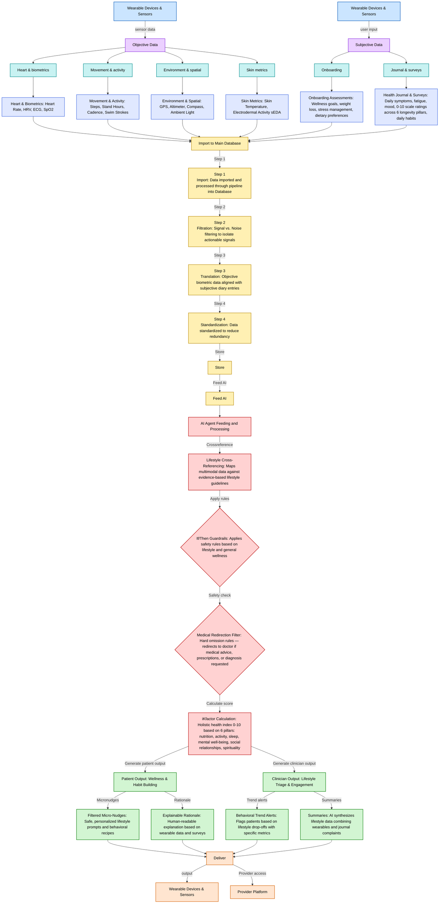

# Data Flow Diagram

```mermaid
flowchart TD
    %% Data Sources
    WDS1["Wearable Devices & Sensors"]
    WDS2["Wearable Devices & Sensors"]
    
    %% User Input Section
    ObjData["Objective Data"]
    SubjData["Subjective Data"]
    
    Heart["Heart & biometrics"]
    Movement["Movement & activity"]
    Environment["Environment & spatial"]
    Skin["Skin metrics"]
    Onboarding["Onboarding"]
    Journal["Journal & surveys"]
    
    HeartDetail["Heart & Biometrics: Heart Rate, HRV, ECG, SpO2"]
    MovementDetail["Movement & Activity: Steps, Stand Hours, Cadence, Swim Strokes"]
    EnvironmentDetail["Environment & Spatial: GPS, Altimeter, Compass, Ambient Light"]
    SkinDetail["Skin Metrics: Skin Temperature, Electrodermal Activity sEDA"]
    OnboardingDetail["Onboarding Assessments: Wellness goals, weight loss, stress management, dietary preferences"]
    JournalDetail["Health Journal & Surveys: Daily symptoms, fatigue, mood, 0-10 scale ratings across 6 longevity pillars, daily habits"]
    
    ImportDB["Import to Main Database"]
    
    %% Processing Steps
    Step1["Step 1<br/>Import: Data imported and processed through pipeline into Database"]
    Step2["Step 2<br/>Filtration: Signal vs. Noise filtering to isolate actionable signals"]
    Step3["Step 3<br/>Translation: Objective biometric data aligned with subjective diary entries"]
    Step4["Step 4<br/>Standardization: Data standardized to reduce redundancy"]
    
    Store["Store"]
    FeedAI["Feed AI"]
    
    %% AI Processing
    AIAgent["AI Agent Feeding and Processing"]
    CrossRef["Lifestyle Cross-Referencing: Maps multimodal data against evidence-based lifestyle guidelines"]
    ApplyRules{"If/Then Guardrails: Applies safety rules based on lifestyle and general wellness"}
    SafetyCheck{"Medical Redirection Filter: Hard omission rules — redirects to doctor if medical advice, prescriptions, or diagnosis requested"}
    CalcScore["iKfactor Calculation: Holistic health index 0-10 based on 6 pillars: nutrition, activity, sleep, mental well-being, social relationships, spirituality"]
    
    %% Outputs
    GenPatient["Patient Output: Wellness & Habit Building"]
    GenClinician["Clinician Output: Lifestyle Triage & Engagement"]
    Micronudges["Filtered Micro-Nudges: Safe, personalized lifestyle prompts and behavioral recipes"]
    Rationale["Explainable Rationale: Human-readable explanation based on wearable data and surveys"]
    TrendAlerts["Behavioral Trend Alerts: Flags patients based on lifestyle drop-offs with specific metrics"]
    Summaries["Summaries: AI synthesizes lifestyle data combining wearables and journal complaints"]
    Deliver["Deliver"]
    ProviderAccess["Provider Platform"]
    WDS3["Wearable Devices & Sensors"]
    
    %% Connections - Data Collection
    WDS1 -->|sensor data| ObjData
    WDS2 -->|user input| SubjData
    
    ObjData --> Heart
    ObjData --> Movement
    ObjData --> Environment
    ObjData --> Skin
    
    SubjData --> Onboarding
    SubjData --> Journal
    
    Heart --> HeartDetail
    Movement --> MovementDetail
    Environment --> EnvironmentDetail
    Skin --> SkinDetail
    Onboarding --> OnboardingDetail
    Journal --> JournalDetail
    
    HeartDetail --> ImportDB
    MovementDetail --> ImportDB
    EnvironmentDetail --> ImportDB
    SkinDetail --> ImportDB
    OnboardingDetail --> ImportDB
    JournalDetail --> ImportDB
    
    %% Processing Pipeline
    ImportDB -->|Step 1| Step1
    Step1 -->|Step 2| Step2
    Step2 -->|Step 3| Step3
    Step3 -->|Step 4| Step4
    Step4 -->|Store| Store
    Store -->|Feed AI| FeedAI
    
    %% AI Processing
    FeedAI --> AIAgent
    AIAgent -->|Crossreference| CrossRef
    CrossRef -->|Apply rules| ApplyRules
    ApplyRules -->|Safety check| SafetyCheck
    SafetyCheck -->|Calculate score| CalcScore
    
    %% Output Generation
    CalcScore -->|Generate patient output| GenPatient
    CalcScore -->|Generate clinician output| GenClinician
    
    GenPatient -->|Micronudges| Micronudges
    GenPatient -->|Rationale| Rationale
    GenClinician -->|Trend alerts| TrendAlerts
    GenClinician -->|Summaries| Summaries
    
    %% Delivery
    Micronudges --> Deliver
    Rationale --> Deliver
    TrendAlerts --> Deliver
    Summaries --> Deliver
    Deliver -->|output| WDS3
    Deliver -->|Provider access| ProviderAccess

    %% Layer-Based Color Definitions (Tier Color Coding with Black Text)
    classDef layer1 fill:#cbe5ff,stroke:#0055b8,stroke-width:1.5px,color:#000000;
    classDef layer2 fill:#ebd0ff,stroke:#8a2be2,stroke-width:1.5px,color:#000000;
    classDef layer3 fill:#c8f2f2,stroke:#008b8b,stroke-width:1.5px,color:#000000;
    classDef layer4 fill:#e0e8ff,stroke:#4169e1,stroke-width:1.5px,color:#000000;
    classDef layer5 fill:#fff0b3,stroke:#b88600,stroke-width:1.5px,color:#000000;
    classDef layer6 fill:#ffd2d2,stroke:#b80000,stroke-width:1.5px,color:#000000;
    classDef layer7 fill:#d2f5d2,stroke:#007a00,stroke-width:1.5px,color:#000000;
    classDef layer8 fill:#ffe5d0,stroke:#d66000,stroke-width:1.5px,color:#000000;

    %% Layer Class Assignments
    class WDS1,WDS2 layer1;
    class ObjData,SubjData layer2;
    class Heart,Movement,Environment,Skin,Onboarding,Journal layer3;
    class HeartDetail,MovementDetail,EnvironmentDetail,SkinDetail,OnboardingDetail,JournalDetail layer4;
    class ImportDB,Step1,Step2,Step3,Step4,Store,FeedAI layer5;
    class AIAgent,CrossRef,ApplyRules,SafetyCheck,CalcScore layer6;
    class GenPatient,GenClinician,Micronudges,Rationale,TrendAlerts,Summaries layer7;
    class Deliver,ProviderAccess,WDS3 layer8;
```
