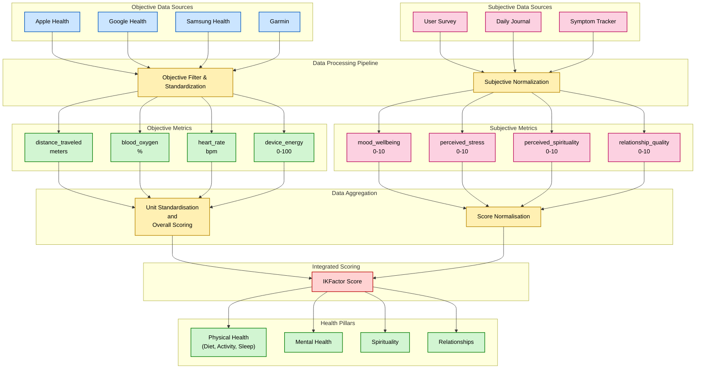

# Health Data Ecosystem Map

```mermaid
flowchart TD
    subgraph ODS["Objective Data Sources"]
        AH["Apple Health"]
        GH["Google Health"]
        SH["Samsung Health"]
        G["Garmin"]
    end

    subgraph SDS["Subjective Data Sources"]
        US["User Survey"]
        DJ["Daily Journal"]
        ST["Symptom Tracker"]
    end

    subgraph DPP["Data Processing Pipeline"]
        OFS["Objective Filter & Standardization"]
        SN["Subjective Normalization"]
    end

    subgraph OM["Objective Metrics"]
        M1["distance_traveled<br/>meters"]
        M2["blood_oxygen<br/>%"]
        M3["heart_rate<br/>bpm"]
        M4["device_energy<br/>0-100"]
    end

    subgraph SM["Subjective Metrics"]
        S1["mood_wellbeing<br/>0-10"]
        S2["perceived_stress<br/>0-10"]
        S3["perceived_spirituality<br/>0-10"]
        S4["relationship_quality<br/>0-10"]
    end

    subgraph DA["Data Aggregation"]
        USOS["Unit Standardisation<br/>and<br/>Overall Scoring"]
        ScN["Score Normalisation"]
    end

    subgraph IS["Integrated Scoring"]
        IK["IKFactor Score"]
    end

    subgraph HP["Health Pillars"]
        PH["Physical Health<br/>(Diet, Activity, Sleep)"]
        MH["Mental Health"]
        SP["Spirituality"]
        RE["Relationships"]
    end

    %% Connections
    AH --> OFS
    GH --> OFS
    SH --> OFS
    G --> OFS

    US --> SN
    DJ --> SN
    ST --> SN

    OFS --> M1 & M2 & M3 & M4
    SN --> S1 & S2 & S3 & S4

    M1 & M2 & M3 & M4 --> USOS
    S1 & S2 & S3 & S4 --> ScN

    USOS --> IK
    ScN --> IK

    IK --> PH & MH & SP & RE

    %% Color Definitions (Enforcing Black Text for Contrast)
    classDef blueNode fill:#cbe5ff,stroke:#0055b8,stroke-width:1.5px,color:#000000;
    classDef pinkNode fill:#fcd1e1,stroke:#b80055,stroke-width:1.5px,color:#000000;
    classDef yellowNode fill:#fff0b3,stroke:#b88600,stroke-width:1.5px,color:#000000;
    classDef redNode fill:#ffd2d2,stroke:#b80000,stroke-width:1.5px,color:#000000;
    classDef greenNode fill:#d2f5d2,stroke:#007a00,stroke-width:1.5px,color:#000000;

    %% Class Assignments by Data Category
    class AH,GH,SH,G blueNode;
    class US,DJ,ST,S1,S2,S3,S4 pinkNode;
    class OFS,SN,USOS,ScN yellowNode;
    class M1,M2,M3,M4,PH,MH,SP,RE greenNode;
    class IK redNode;
```
